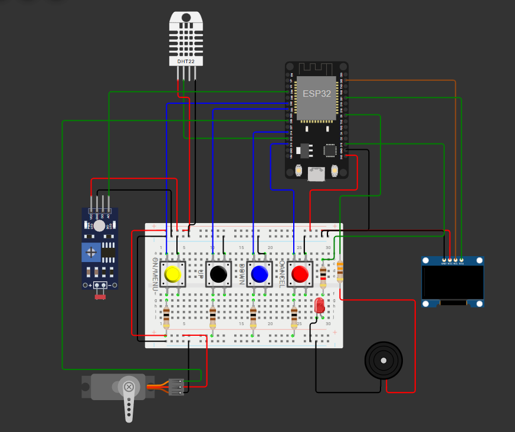
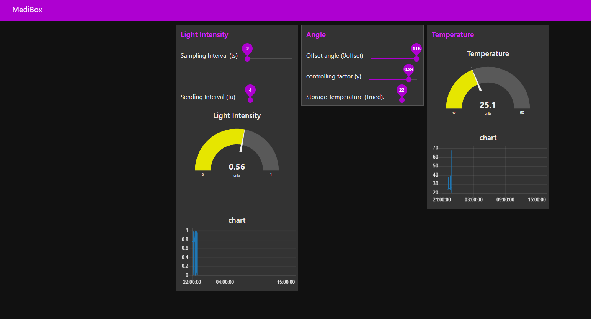

# 🧑‍⚕️ MediBox – IoT-Powered Medicine Reminder 

MediBox is a **smart, connected health assistant** built using **ESP32**. It offers **medicine scheduling**, **environmental monitoring**, and **remote parameter control** via **MQTT** and **Node-RED**. Simulated on **Wokwi** and ready for **real-world deployment**.

---

## 🎯 Core Capabilities

### 🕑 Smart Medicine Reminders
- Manage **two fully configurable alarms**.
- **Snooze support** with retry limits.
- **Push-button interface** for on-device configuration.
- **Buzzer** and **LED** notifications when it’s time.

### 🌡️ Live Environment Monitoring
- **DHT22 sensor** tracks temperature and humidity.
- **LDR sensor** measures ambient light conditions.
- Real-time **servo adjustment** based on light and temperature using mathematical control logic.

### 🖥️ Local Display & Navigation
- **OLED display** shows time, alarms, and system status.
- **Physical buttons** for menu navigation and interaction.

### 🌐 Remote Connectivity & Control
- **MQTT publishing** to send sensor data to the cloud.
- **Node-RED dashboard** for live visualization and parameter tuning.

---

## 🏗️ System Overview

| 🛠️ **Component**      | **Description**                                |
|-----------------------|-------------------------------------------------|
| 📡 **ESP32**          | Wi-Fi-enabled microcontroller                   |
| 🌬️ **DHT22 Sensor**   | Temperature & Humidity measurement              |
| 💡 **LDR Sensor**     | Light intensity detection                       |
| ⚙️ **Servo Motor**    | Adjusting shaded sliding window                 |
| 🖲️ **Push Buttons**   | User interaction for setting & navigation       |
| 📢 **Buzzer & LED**    | Audio-visual medicine reminders              |
| 🖥️ **OLED Display**   | User interface                                  |
| 🛰️ **Node-RED Dashboard** | Cloud-based control & visualization       |

---

## 🗂️ Project Architecture

1. **Hardware Functions**
   - **Inputs:** DHT22, LDR, Buttons
   - **Outputs:** Servo, Buzzer, LED, OLED

2. **Cloud Connectivity**
   - MQTT topics for:
     - `Ts` – Sampling Interval
     - `Tu` – Sending Interval
     - `offset` – Servo Offset
     - `gamma` – Control Factor
     - `Tmed` – Target Temperature

3. **Control Logic**
   - **Mathematical model** for servo positioning.
   - **Alarm system** with snooze management.

---

## 📸 System Demo

### 🔌 Try the project now on **Wokwi**: 

 
👉 [Open Wokwi Simulation](https://wokwi.com/projects/1234567890abcdef)

### 📊 Node-RED Control Panel

 
👉 [Open Node-Red Dashboard](https://medibox.flowfuse.cloud/ui/#!/0?socketid=9VnMcR1psmGuU5jqAAB3)

---

